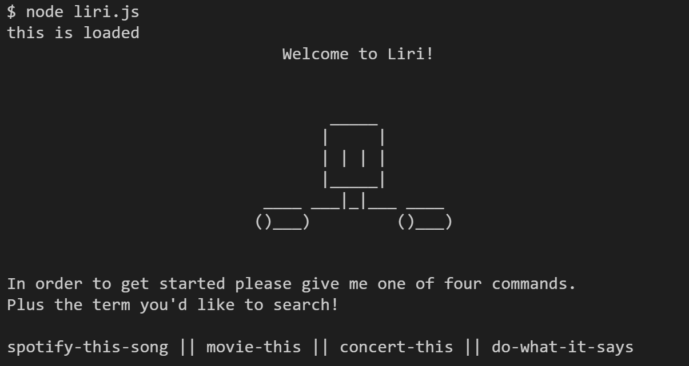

# LIRI Bot :computer::microphone::headphones::clapper::floppy_disk:

LIRI Bot is a Node.JS Language Input Robot Interface that takes language commands ads runs a function. This current robot can do a myriad of things and had four commands to start: spotify-this, movie-this, concert-this, and do-what-it-says. You will find demo videos below breaking down the details of what they do. Please feel free to give it a try!

# APIs and NPM Packages used in the creation of this site:

Spotify -- https://www.spotify.com/

Band-In-Town -- https://www.bandsintown.com/en

OMDB -- http://www.omdbapi.com/

Moment.JS -- https://www.npmjs.com/package/moment

Inquirer.JS -- https://www.npmjs.com/package/inquirer

fs -- https://www.npmjs.com/package/fs

## Intro 

## Spotify-This
The spotify-this command combined with a song track will query Spotify's API for all related songs up to 20 and return them for your viewing.

##### <i>Default (run blank): The Sign </i>

## Movie-This

The movie-this command combined with a movie choice will spit back a lot of popular information relevant to your chosen movie.

##### <i>Default (run blank): Mr. Nobody</i>

## Concert-This

When running concert-this along with a band or performer of choice you will receive back all the results of their upcoming venues. The time is formatted using Moment.JS.

##### <i>Default (run blank): Shinedown</i>

## Do-What-It-Says

Running do-what-it-says will take in a file names random.txt and runn the command kept inside. for this demo the contents of the random.txt file are: spotify-this-song,"I Want it That Way"

## File Write to Create a Log File

In order to create a log file we are using the fs npm package to writeData(); to a text file called log.txt. All data that is run and displayed in the terminal is also reflected in the file. It also does this without overwriting the file. As you can see in the uploaded log file it took some formatting attempts to get the data to read properly.

